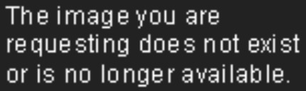

  

<h1 align="center">hi, i'm <a href="#">rockyxwall</a>!</h1>

<h3 align="center">welcome to my profile</h3>

student `tech hobbyist` learning webdev

  <!-- <strong><a href="#">Website</a></strong> |
  <strong><a href="#">Twitter</a></strong> |
  <strong><a href="#">Bluesky</a></strong> |
  <strong><a href="#">Discord</a></strong> |
  <strong><a href="#">PGP</a></strong> -->
  _links-under-construction_

### 🛠️ Languages and Tools

  

### 🌀 Projects

| HTML(), CSS() | JavaScript()         |
| --------------------------------------------------------------------------------------------------------------------------------------------------------------------------------------------------------------- | -------------------------------------------------------------------------------------------------------------------------------- |
| • [lazy-study-doc](https://github.com/rockyxwall/lazy-study-doc) - personal site where I listed some online resources that I used to study for high school.                                                     | • [js-core-projects](https://github.com/rockyxwall/js-core-projects) - All the basic projects I have done to learn the language. |
| • [my-user-scripts-and-styles](https://github.com/rockyxwall/my-user-scripts-and-styles) - user scripts and styles for personal use                                                                             |                                                                                                                                  |

### ⚡ Stats

T_T
